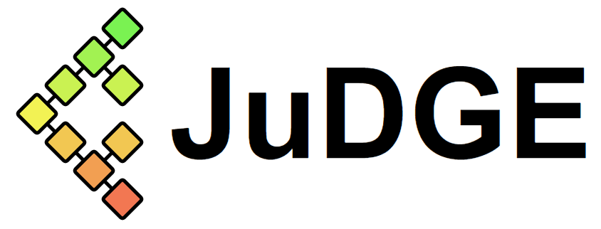

```@meta
CurrentModule = JuDGE
DocTestSetup = quote
    using JuDGE
end
```


# JuDGE.jl

JuDGE stands for: Julia Decomposition for Generalized Expansion. Functionally,
it is a solver which leverages the syntax of the JuMP modelling language to
solve a particular class of capacity expansion problems.

For more details see our working paper: [JuDGE.jl: a Julia package for optimizing capacity expansion](http://www.optimization-online.org/DB_HTML/2020/11/8086.html).

## Problem Class / Decomposition

JuDGE solves multi-stage stochastic integer programming problems using
Dantzig-Wolfe decomposition. The user must specify a tree that represents
the uncertainty of the problem, and at each node define a subproblem that
can be a linear or integer program. Further, the expansion variables which
link the subproblems must be declared.

JuDGE automatically generates a master problem and performs column generation
to converge to an optimal solution.

## Requirements

JuDGE requires Julia-1.3+, JuMP and appropriate optimiser(s). For academics,
Gurobi / CPLEX provide free academic licenses, otherwise, you can use CBC/Clp or
GLPK.

## Installation

JuDGE is installed by the `Pkg` utility provided by Julia. In the Julia REPL,
simply make the following function call.

    ] add "https://github.com/reganbaucke/JuDGE.jl"

Then, in your Julia script, use

    using JuDGE
to import the functions from the JuDGE module into the current namespace.

## Stochastic Knapsack Example

JuDGE is distributed with an example of a multi-stage stochastic integer
programming problem. This is a stochastic knapsack problem with investment.
The file knapsack.jl contains the implementation of this problem within the
JuDGE framework. There are also a number of variants of this model demonstrating
other features of JuDGE.

See the [Tutorials](@ref) for details about this.

## Limitations

- For each expansion variable, there can only be one expansion (i.e. variable is binary).
Note that from version 0.62 it is possible to have continuous investments in the master problem.
This is untested and undocumented; however there is an example provided: newsvendor_continuous.jl.
If all investments are continuous this is expected to work, but if you have a mixture of
continuous and discrete investments, then it is necessary that the subproblems are strictly
convex with respect to the investment costs of continous variables.

- Support for decisions to reduce capacity is not fully tested.


## Bugs

Please raise an [issue](https://github.com/reganbaucke/JuDGE.jl/issues) if you experience an error while using JuDGE.
